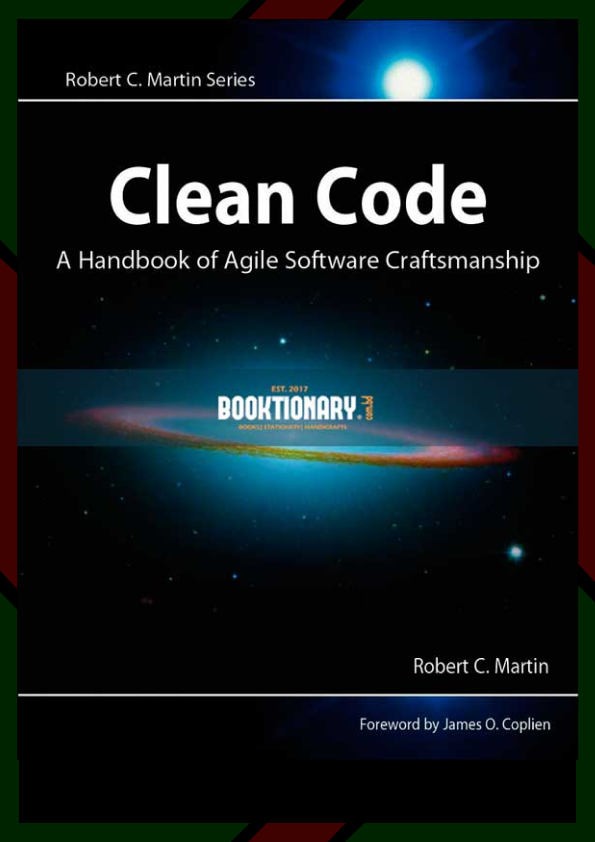

# Clean Code: A Handbook of Agile Software Craftsmanship by Robert C. Martin

## Overview

"Clean Code: A Handbook of Agile Software Craftsmanship" by Robert C. Martin, often referred to as Uncle Bob, is a seminal work in the world of software development. This book is a treasure trove of principles, practices, and guidelines that help programmers write clean, maintainable, and efficient code. It's a must-read for software developers at all levels of experience, from beginners to seasoned professionals.

## Key Takeaways

- **Clean Code Philosophy**: The book emphasizes the importance of clean, readable, and understandable code as the foundation of successful software development.

- **Coding Standards**: Robert C. Martin introduces coding standards and conventions that promote consistency and clarity in code.

- **SOLID Principles**: The book covers the SOLID principles (Single Responsibility, Open-Closed, Liskov Substitution, Interface Segregation, and Dependency Inversion) and demonstrates how they lead to robust and maintainable code.

- **Code Smells**: Learn to identify and refactor code smells, such as duplicated code, long methods, and excessive dependencies.

- **Testing and Test-Driven Development (TDD)**: Explore the significance of testing in the development process and how TDD can lead to cleaner and more reliable code.

- **Naming Conventions**: Discover the art of choosing meaningful and descriptive names for variables, functions, and classes.

## Why Read This Book?

- **Professional Growth**: "Clean Code" will transform the way you approach software development, helping you become a more effective and efficient programmer.

- **Team Collaboration**: Applying the principles in this book fosters better collaboration among team members, as clean code is easier to understand and maintain.

- **Career Advancement**: Mastering clean coding practices will make you a sought-after developer in the industry, opening doors to exciting career opportunities.

## How to Use This Repository

This repository serves as a resource companion to "Clean Code." You can find code examples, summaries of key concepts, and additional resources related to the book.

### Contents

- **Code Examples**: Browse through real-world code examples that illustrate the principles discussed in the book.

- **Summaries**: Find concise summaries of each chapter, highlighting the key takeaways and best practices.

- **Additional Resources**: Explore links to articles, videos, and tools that complement the concepts presented in the book.

## Contributing

Contributions to this repository are welcome! If you have code examples, summaries, or additional resources related to "Clean Code," feel free to submit pull requests or open issues.

## Resources

- [Buy the Book on Amazon](insert_amazon_link_here)
- [Author's Website](insert_author_website_link_here)
- [Clean Code YouTube Playlist](insert_clean_code_youtube_playlist_link_here)

Happy reading and coding!
